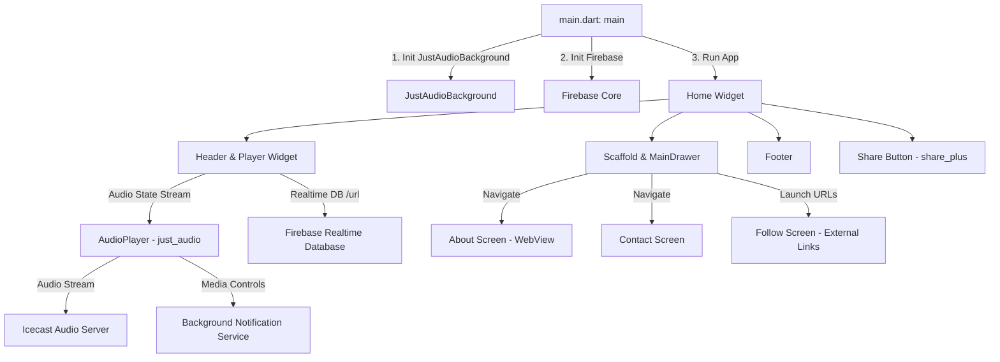

# Radio 90 FM - Complete Codebase Guide & Architecture Overview

This document provides a comprehensive technical overview of the **Radio 90 FM** Flutter codebase. It is designed to give AI agents and human developers an immediate, complete understanding of the application architecture, data flow, component hierarchy, dependencies, and file responsibilities.

---

## 1. Executive Summary

- **App Name**: Radio 90 FM ("Voice of Amal Jyothi" / "Celebration of Knowledge")
- **Platform**: Flutter Cross-Platform (Android, iOS, Web, macOS, Windows)
- **Primary Functionality**: Live Internet radio streaming app for Radio 90 FM (operating out of Amal Jyothi College of Engineering, Kanjirappally, Kerala).
- **Core Capabilities**:
  - Live audio streaming via Icecast HTTP/HTTPS stream.
  - Background audio playback with system notification controls and media metadata lockscreen integration.
  - Dynamic stream configuration via Firebase Realtime Database.
  - Side drawer navigation for station info, contact details, webview integration, and social media links.
  - Native app link sharing.

---

## 2. Tech Stack & Key Dependencies

| Dependency | Version | Purpose |
| :--- | :--- | :--- |
| [`flutter`](https://flutter.dev) | SDK `>=3.2.6 <4.0.0` | Core UI Framework |
| [`just_audio`](https://pub.dev/packages/just_audio) | `^0.9.36` | High-performance audio streaming player |
| [`just_audio_background`](https://pub.dev/packages/just_audio_background) | `^0.0.1-beta.11` | Background audio playback & lockscreen media notification controls |
| [`firebase_core`](https://pub.dev/packages/firebase_core) | `^2.27.0` | Firebase project initialization |
| [`firebase_database`](https://pub.dev/packages/firebase_database) | `^10.4.9` | Realtime Database configuration listener |
| [`webview_flutter`](https://pub.dev/packages/webview_flutter) | `^4.7.0` | In-app browser widget for viewing `https://radio90.in` |
| [`font_awesome_flutter`](https://pub.dev/packages/font_awesome_flutter) | `^10.7.0` | Social media icon library |
| [`url_launcher`](https://pub.dev/packages/url_launcher) | `^6.2.4` | External link opening (Facebook, Instagram, Spotify, YouTube, WhatsApp, X) |
| [`share_plus`](https://pub.dev/packages/share_plus) | `^7.2.2` | Native OS share sheet dialogs |
| [`text_scroll`](https://pub.dev/packages/text_scroll) | `^0.2.0` | Horizontal marquee scrolling text ticker |
| [`flutter_launcher_icons`](https://pub.dev/packages/flutter_launcher_icons) | `^0.13.1` | Asset-driven launcher icon generation |

---

## 3. Architecture & Data Flow



### Audio Playback Lifecycle & State Machine
1. **Initialization**: On `initState` in [`lib/player.dart`](file:///Users/tomkurian/Development/Radio%20Flutter/Radio90FM/radio90fm/lib/player.dart), an `AudioPlayer` instance is instantiated and configured with an `AudioSource.uri` (`https://icecast.octosignals.com/radio90_final`) and attached `MediaItem` metadata for lockscreen integration.
2. **Firebase Realtime Sync**: A listener is attached to `FirebaseDatabase.instance.ref('/url')` to reactively capture dynamic stream URL changes.
3. **State Rendering**: A `StreamBuilder` monitors `_audioPlayer.playerStateStream`:
   - **Paused/Stopped**: Displays a large Play button (`Icons.play_circle_filled_rounded`).
   - **Loading/Buffering**: Displays a Pause button wrapped with a red `CircularProgressIndicator` and a "Loading..." message.
   - **Playing/Ready**: Displays a Pause button and a scrolling `TextScroll` marquee ("Radio 90 FM Live from Amal Jyothi College of Engineering").

---

## 4. File-by-File Directory Guide

Below is the directory mapping of the source code located in `lib/`:

```
lib/
├── aboutus.dart          # WebView component for official website
├── contactus.dart        # Station address, phone numbers, and email contacts
├── firebase_options.dart # Auto-generated Firebase configurations per platform
├── follow.dart           # Reusable social media links bar using FontAwesome icons
├── home.dart             # Main screen wrapper, app layout, and header/footer
├── main.dart             # Application entry point & background services setup
├── mydrawer.dart         # Side navigation drawer (hamburger menu)
└── player.dart           # Live audio stream player core component
```

### Detailed Component Documentation

#### 1. [`lib/main.dart`](file:///Users/tomkurian/Development/Radio%20Flutter/Radio90FM/radio90fm/lib/main.dart)
- **Purpose**: App entrypoint.
- **Key Logic**:
  - Calls `JustAudioBackground.init()` to setup background notification service channels (`com.ryanheise.bg_demo.channel.audio`).
  - Calls `Firebase.initializeApp()` with `DefaultFirebaseOptions.currentPlatform`.
  - Mounts the root `Home` widget.

#### 2. [`lib/home.dart`](file:///Users/tomkurian/Development/Radio%20Flutter/Radio90FM/radio90fm/lib/home.dart)
- **Purpose**: Primary screen container and visual shell.
- **Key Widgets**:
  - `Home`: `StatelessWidget` returning `MaterialApp` with a dark gradient background (`Colors.black` to deep red `Color.fromARGB(255, 67, 4, 0)`). Uses a `ScaffoldKey` to programmatically open the drawer.
  - Top Left `IconButton`: Triggers `scaffoldKey.currentState!.openDrawer()`.
  - Top Right `IconButton`: Uses `Share.share()` to share the mobile app install link (`https://onelink.to/243uae`).
  - `Header`: Contains the main radio station brand image (`assets/images/icon.png`) and mounts the `Player` widget.
  - `Footer`: Displays branding text ("Radio 90 FM - Celebration of Knowledge").

#### 3. [`lib/player.dart`](file:///Users/tomkurian/Development/Radio%20Flutter/Radio90FM/radio90fm/lib/player.dart)
- **Purpose**: Core audio player control and state renderer.
- **Key Logic**:
  - Implements `WidgetsBindingObserver` for lifecycle handling.
  - Audio stream target: `https://icecast.octosignals.com/radio90_final`.
  - Notification Metadata (`MediaItem`):
    - `id`: `'1'`
    - `album`: `'Radio 90 PM'`
    - `title`: `'Voice of Amal Jyothi'`
    - `artUri`: `'https://radio90.in/wp-content/uploads/2023/01/Logo-Black-Png.png'`
  - Firebase Listener: Listens to `/url` path on `FirebaseDatabase`.
  - UI State Machine: Uses `StreamBuilder<PlayerState>` over `_audioPlayer.playerStateStream`.

#### 4. [`lib/mydrawer.dart`](file:///Users/tomkurian/Development/Radio%20Flutter/Radio90FM/radio90fm/lib/mydrawer.dart)
- **Purpose**: Navigation drawer for secondary screens.
- **Key Logic**:
  - `MainDrawer`: Displays logo header (`assets/images/logo.png`), navigation `ListTile`s for "About Us" and "Contact Us", and embeds the `Follow` social widget at the bottom.

#### 5. [`lib/aboutus.dart`](file:///Users/tomkurian/Development/Radio%20Flutter/Radio90FM/radio90fm/lib/aboutus.dart)
- **Purpose**: In-app web view displaying station information.
- **Key Logic**:
  - Instantiates `WebViewController()` targeting `https://radio90.in`.
  - Implements a `NavigationDelegate` that prevents navigation to YouTube URLs within the embedded web view.

#### 6. [`lib/contactus.dart`](file:///Users/tomkurian/Development/Radio%20Flutter/Radio90FM/radio90fm/lib/contactus.dart)
- **Purpose**: Contact information screen.
- **Key Logic**:
  - Renders institution header image (`assets/images/logo2.png`).
  - Displays address (Amal Jyothi College of Engineering, Kanjirappally, Koovappally P.O, Kottayam, Kerala 686518).
  - Displays contact numbers for Program Director, Assistant Program Director, PRO & Marketing Manager (Sino Antony), and Official WhatsApp.

#### 7. [`lib/follow.dart`](file:///Users/tomkurian/Development/Radio%20Flutter/Radio90FM/radio90fm/lib/follow.dart)
- **Purpose**: Social media links widget.
- **Key Logic**:
  - Uses `url_launcher`'s `launchUrl()` to open social links:
    - **Facebook**: `https://www.facebook.com/fm.radio90/`
    - **YouTube**: `https://youtube.com/@radio90fm13`
    - **Instagram**: `https://www.instagram.com/radio90.fm`
    - **WhatsApp**: `https://wa.me/9048389090`
    - **X (Twitter)**: `https://twitter.com/Radio90FM_AJCE`
    - **Spotify**: `https://open.spotify.com/show/68Ii81VKFBzRWKnEo2y1Oe`

#### 8. [`lib/firebase_options.dart`](file:///Users/tomkurian/Development/Radio%20Flutter/Radio90FM/radio90fm/lib/firebase_options.dart)
- **Purpose**: FlutterFire CLI configuration file defining platform-specific `FirebaseOptions` for Project ID `radio90fm-3cc99`.

---

## 5. Configuration & Platform Setup

### App Identifiers & Build Specs
- **Android Application ID**: `com.radio90fm` ([`android/app/build.gradle`](file:///Users/tomkurian/Development/Radio%20Flutter/Radio90FM/radio90fm/android/app/build.gradle#L54))
- **iOS Bundle ID**: `com.radio90fm` ([`lib/firebase_options.dart`](file:///Users/tomkurian/Development/Radio%20Flutter/Radio90FM/radio90fm/lib/firebase_options.dart#L67))
- **Target Android SDK**: `34`
- **Min Android SDK**: `21`
- **Flutter Version Requirement**: `>=3.2.6 <4.0.0`

### Assets
Configured in [`pubspec.yaml`](file:///Users/tomkurian/Development/Radio%20Flutter/Radio90FM/radio90fm/pubspec.yaml#L52):
- `assets/images/icon.png`: Main station logo used on player header.
- `assets/images/logo.png`: Drawer header logo.
- `assets/images/logo2.png`: Contact page logo banner.
- `assets/images/appicon.png`: App launcher icon source.

---

## 6. Developer & Agent Guidelines

1. **Audio State Testing**: When making changes to [`lib/player.dart`](file:///Users/tomkurian/Development/Radio%20Flutter/Radio90FM/radio90fm/lib/player.dart), ensure that `_audioPlayer` resources are cleanly disposed on widget unmount.
2. **Background Permissions**: Android background audio playback requires `FOREGROUND_SERVICE` and `WAKE_LOCK` permissions in `AndroidManifest.xml`, handled in tandem with `just_audio_background`.
3. **HTTP/HTTPS Links**: Note that Icecast streaming links and web assets use HTTPS (`https://icecast.octosignals.com/radio90_final`). Always ensure cleartext traffic policy is maintained or HTTPS endpoints are specified.
4. **Modifying Navigation**: All drawer route navigations are performed via `Navigator.of(context).push(MaterialPageRoute(...))`.
